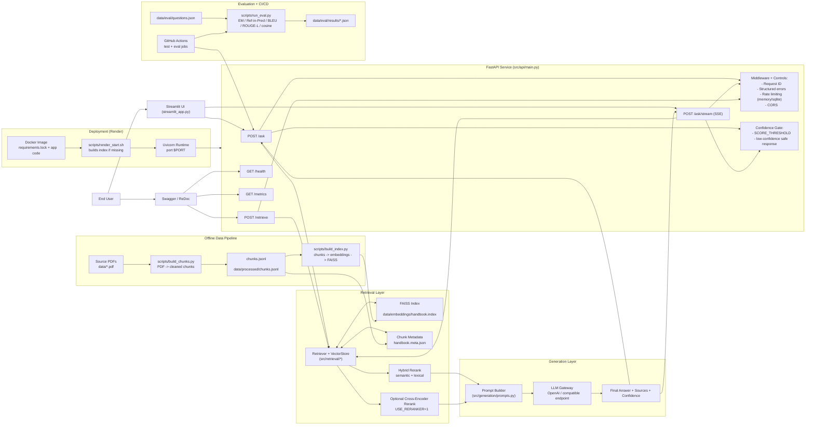
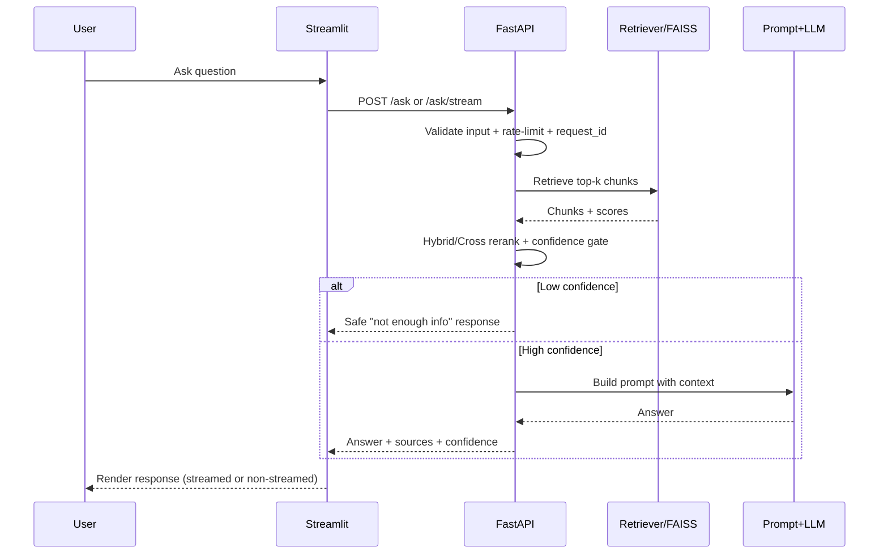

# CA DMV RAG System Architecture

This diagram reflects the current production-ready design: ingestion + FAISS indexing, FastAPI serving, Streamlit client, evaluation workflow, and Render deployment/runtime controls.

## Request Lifecycle (Ask)

